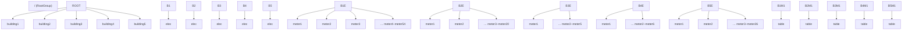

```mermaid

flowchart TD


ROOT\["/ (RootGroup)"]


%% Buildings

ROOT --> B1\["building1"]

ROOT --> B2\["building2"]

ROOT --> B3\["building3"]

ROOT --> B4\["building4"]

ROOT --> B5\["building5"]


%% Elec groups

B1 --> B1E\["elec"]

B2 --> B2E\["elec"]

B3 --> B3E\["elec"]

B4 --> B4E\["elec"]

B5 --> B5E\["elec"]


%% Representative meters only

B1E --> B1M1\["meter1"]

B1E --> B1M2\["meter2"]

B1E --> B1M3\["meter3"]

B1E --> B1More\["… meter4–meter54"]


B2E --> B2M1\["meter1"]

B2E --> B2M2\["meter2"]

B2E --> B2More\["… meter3–meter20"]


B3E --> B3M1\["meter1"]

B3E --> B3More\["… meter2–meter5"]


B4E --> B4M1\["meter1"]

B4E --> B4More\["… meter2–meter6"]


B5E --> B5M1\["meter1"]

B5E --> B5M2\["meter2"]

B5E --> B5More\["… meter3–meter26"]


%% Table nodes (representative only)

B1M1 --> B1M1T\["table"]

B2M1 --> B2M1T\["table"]

B3M1 --> B3M1T\["table"]

B4M1 --> B4M1T\["table"]

B5M1 --> B5M1T\["table"]

```

