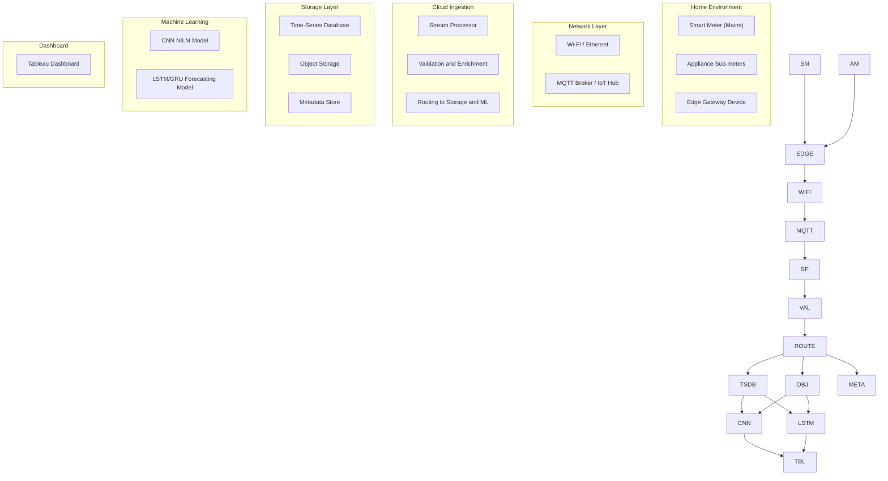

```mermaid

flowchart TB


%% Home Layer

subgraph Home\["Home Environment"]

SM\["Smart Meter (Mains)"]

AM\["Appliance Sub-meters"]

EDGE\["Edge Gateway Device"]

end


%% Network Layer

subgraph Network\["Network Layer"]

WIFI\["Wi-Fi / Ethernet"]

MQTT\["MQTT Broker / IoT Hub"]

end


%% Cloud Ingestion

subgraph Ingestion\["Cloud Ingestion"]

SP\["Stream Processor"]

VAL\["Validation and Enrichment"]

ROUTE\["Routing to Storage and ML"]

end


%% Storage Layer

subgraph Storage\["Storage Layer"]

TSDB\["Time-Series Database"]

OBJ\["Object Storage"]

META\["Metadata Store"]

end


%% ML Layer

subgraph ML\["Machine Learning"]

CNN\["CNN NILM Model"]

LSTM\["LSTM/GRU Forecasting Model"]

end


%% Dashboard Layer

subgraph Dashboard\["Dashboard"]

TBL\["Tableau Dashboard"]

end


%% Connections

SM --> EDGE

AM --> EDGE

EDGE --> WIFI --> MQTT

MQTT --> SP --> VAL --> ROUTE

ROUTE --> TSDB

ROUTE --> OBJ

ROUTE --> META

TSDB --> CNN

TSDB --> LSTM

OBJ --> CNN

OBJ --> LSTM

CNN --> TBL

LSTM --> TBL

```

