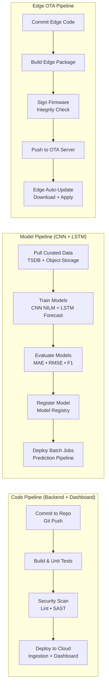

```mermaid
flowchart LR

%% Code Pipeline
subgraph CODE["Code Pipeline (Backend + Dashboard)"]
CODE_COMMIT["Commit to Repo<br/>Git Push"]
CODE_BUILD["Build & Unit Tests"]
CODE_SCAN["Security Scan<br/>Lint • SAST"]
CODE_DEPLOY["Deploy to Cloud<br/>Ingestion + Dashboard"]
end

%% Model Pipeline
subgraph MODEL["Model Pipeline (CNN + LSTM)"]
DATA_PULL["Pull Curated Data<br/>TSDB + Object Storage"]
TRAIN["Train Models<br/>CNN NILM + LSTM Forecast"]
EVAL["Evaluate Models<br/>MAE • RMSE • F1"]
REGISTRY["Register Model<br/>Model Registry"]
BATCH_DEPLOY["Deploy Batch Jobs<br/>Prediction Pipeline"]
end

%% Edge OTA Pipeline
subgraph EDGE["Edge OTA Pipeline"]
EDGE_COMMIT["Commit Edge Code"]
EDGE_BUILD["Build Edge Package"]
EDGE_SIGN["Sign Firmware<br/>Integrity Check"]
EDGE_PUSH["Push to OTA Server"]
EDGE_UPDATE["Edge Auto‑Update<br/>Download + Apply"]
end

%% Connections
CODE_COMMIT --> CODE_BUILD --> CODE_SCAN --> CODE_DEPLOY
DATA_PULL --> TRAIN --> EVAL --> REGISTRY --> BATCH_DEPLOY
EDGE_COMMIT --> EDGE_BUILD --> EDGE_SIGN --> EDGE_PUSH --> EDGE_UPDATE
```
