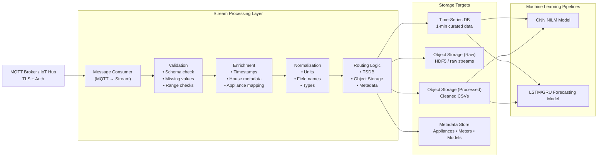

```mermaid
flowchart LR

%% MQTT Input
MQTT["MQTT Broker / IoT Hub<br/>TLS + Auth"]

%% Stream Processor
subgraph SP["Stream Processing Layer"]
CONSUME["Message Consumer<br/>(MQTT → Stream)"]
VALIDATE["Validation<br/>• Schema check<br/>• Missing values<br/>• Range checks"]
ENRICH["Enrichment<br/>• Timestamps<br/>• House metadata<br/>• Appliance mapping"]
NORMALIZE["Normalization<br/>• Units<br/>• Field names<br/>• Types"]
ROUTE["Routing Logic<br/>• TSDB<br/>• Object Storage<br/>• Metadata"]
end

%% Storage Targets
subgraph STORAGE["Storage Targets"]
TSDB["Time‑Series DB<br/>1‑min curated data"]
OBJ_RAW["Object Storage (Raw)<br/>HDF5 / raw streams"]
OBJ_PROC["Object Storage (Processed)<br/>Cleaned CSVs"]
META["Metadata Store<br/>Appliances • Meters • Models"]
end

%% ML Pipelines
subgraph ML["Machine Learning Pipelines"]
CNN["CNN NILM Model"]
LSTM["LSTM/GRU Forecasting Model"]
end

%% Connections
MQTT --> CONSUME --> VALIDATE --> ENRICH --> NORMALIZE --> ROUTE
ROUTE --> TSDB
ROUTE --> OBJ_RAW
ROUTE --> OBJ_PROC
ROUTE --> META

TSDB --> CNN
TSDB --> LSTM
OBJ_PROC --> CNN
OBJ_PROC --> LSTM
```
