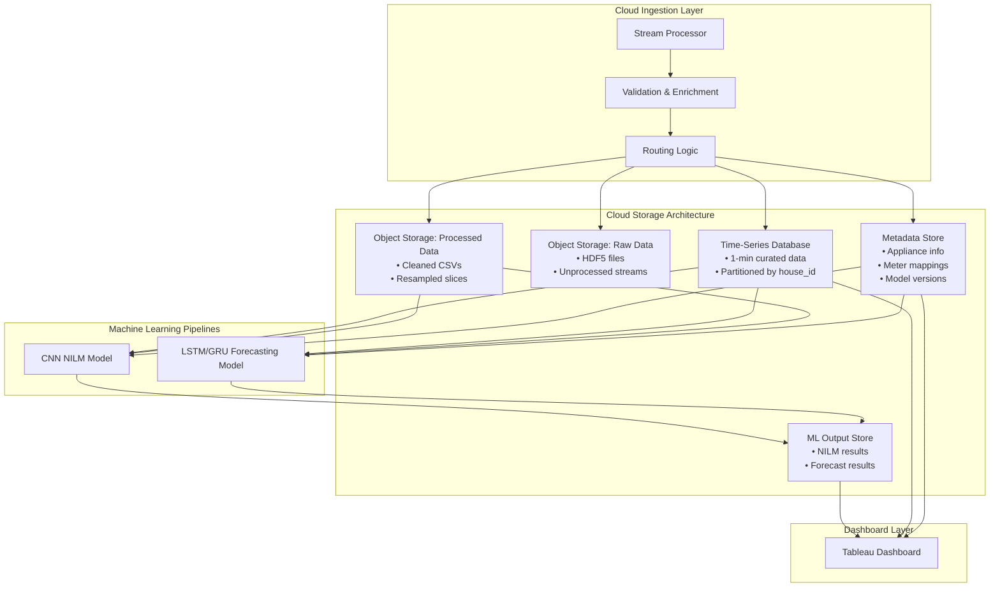

```mermaid
flowchart TB

%% Ingestion Layer
subgraph INGEST["Cloud Ingestion Layer"]
SP["Stream Processor"]
VAL["Validation & Enrichment"]
ROUTE["Routing Logic"]
end

%% Storage Layer
subgraph STORAGE["Cloud Storage Architecture"]
TSDB["Time‑Series Database<br/>• 1‑min curated data<br/>• Partitioned by house_id"]
OBJ_RAW["Object Storage: Raw Data<br/>• HDF5 files<br/>• Unprocessed streams"]
OBJ_PROC["Object Storage: Processed Data<br/>• Cleaned CSVs<br/>• Resampled slices"]
META["Metadata Store<br/>• Appliance info<br/>• Meter mappings<br/>• Model versions"]
ML_OUT["ML Output Store<br/>• NILM results<br/>• Forecast results"]
end

%% ML Layer
subgraph ML["Machine Learning Pipelines"]
CNN["CNN NILM Model"]
LSTM["LSTM/GRU Forecasting Model"]
end

%% Dashboard
subgraph DASH["Dashboard Layer"]
TBL["Tableau Dashboard"]
end

%% Ingestion to Storage
SP --> VAL --> ROUTE
ROUTE --> TSDB
ROUTE --> OBJ_RAW
ROUTE --> OBJ_PROC
ROUTE --> META

%% Storage to ML
TSDB --> CNN
TSDB --> LSTM
OBJ_PROC --> CNN
OBJ_PROC --> LSTM
META --> CNN
META --> LSTM

%% ML Outputs
CNN --> ML_OUT
LSTM --> ML_OUT

%% Dashboard
ML_OUT --> TBL
TSDB --> TBL
META --> TBL
```
