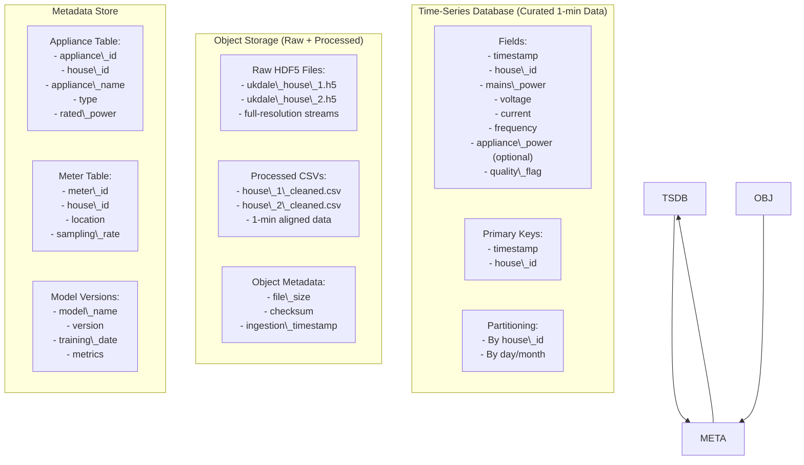

```mermaid

flowchart TB


%% TSDB Schema

subgraph TSDB\["Time‑Series Database (Curated 1‑min Data)"]

TSDB\_FIELDS\["Fields:<br/>- timestamp<br/>- house\_id<br/>- mains\_power<br/>- voltage<br/>- current<br/>- frequency<br/>- appliance\_power (optional)<br/>- quality\_flag"]

TSDB\_KEYS\["Primary Keys:<br/>- timestamp<br/>- house\_id"]

TSDB\_PART\["Partitioning:<br/>- By house\_id<br/>- By day/month"]

end


%% Object Storage Schema

subgraph OBJ\["Object Storage (Raw + Processed)"]

RAW\["Raw HDF5 Files:<br/>- ukdale\_house\_1.h5<br/>- ukdale\_house\_2.h5<br/>- full-resolution streams"]

PROC\["Processed CSVs:<br/>- house\_1\_cleaned.csv<br/>- house\_2\_cleaned.csv<br/>- 1‑min aligned data"]

OBJ\_META\["Object Metadata:<br/>- file\_size<br/>- checksum<br/>- ingestion\_timestamp"]

end


%% Metadata Store Schema

subgraph META\["Metadata Store"]

APPL\["Appliance Table:<br/>- appliance\_id<br/>- house\_id<br/>- appliance\_name<br/>- type<br/>- rated\_power"]

METER\["Meter Table:<br/>- meter\_id<br/>- house\_id<br/>- location<br/>- sampling\_rate"]

MODEL\["Model Versions:<br/>- model\_name<br/>- version<br/>- training\_date<br/>- metrics"]

end


%% Connections

TSDB --> META

OBJ --> META

META --> TSDB

```

