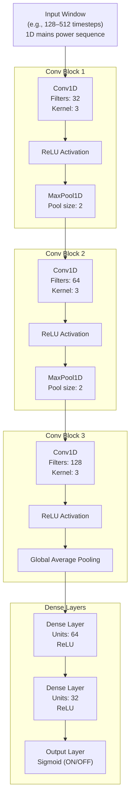

```mermaid
flowchart TB

%% Input
INPUT["Input Window<br/>(e.g., 128–512 timesteps)<br/>1D mains power sequence"]

%% Conv Block 1
subgraph BLOCK1["Conv Block 1"]
CONV1["Conv1D<br/>Filters: 32<br/>Kernel: 3"]
RELU1["ReLU Activation"]
POOL1["MaxPool1D<br/>Pool size: 2"]
end

%% Conv Block 2
subgraph BLOCK2["Conv Block 2"]
CONV2["Conv1D<br/>Filters: 64<br/>Kernel: 3"]
RELU2["ReLU Activation"]
POOL2["MaxPool1D<br/>Pool size: 2"]
end

%% Conv Block 3
subgraph BLOCK3["Conv Block 3"]
CONV3["Conv1D<br/>Filters: 128<br/>Kernel: 3"]
RELU3["ReLU Activation"]
GAP["Global Average Pooling"]
end

%% Dense Layers
subgraph DENSE["Dense Layers"]
D1["Dense Layer<br/>Units: 64<br/>ReLU"]
D2["Dense Layer<br/>Units: 32<br/>ReLU"]
OUT["Output Layer<br/>Sigmoid (ON/OFF)"]
end

%% Connections
INPUT --> CONV1 --> RELU1 --> POOL1 --> CONV2 --> RELU2 --> POOL2 --> CONV3 --> RELU3 --> GAP --> D1 --> D2 --> OUT
```
