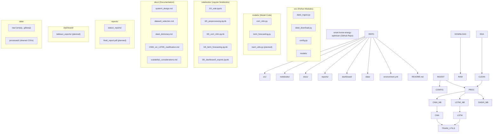

```mermaid

flowchart TD


%% Top-level repo

REPO\["smart-home-energy-optimizer (GitHub Repo)"]


%% Directories

REPO --> SRC\["src/"]

REPO --> NOTE\["notebooks/"]

REPO --> DOCS\["docs/"]

REPO --> REPORTS\["reports/"]

REPO --> DASH\["dashboard/"]

REPO --> DATA\["data/"]

REPO --> ENV\["environment.yml"]

REPO --> README\["README.md"]


%% src/

subgraph SRC\_DIR\["src/ (Python Modules)"]

INGEST\["data\_ingest.py"]

DOWNLOAD\["data\_download.py"]

CONFIG\["config.py"]

MODELS\["models/"]

end


%% models/

subgraph MODELS\_DIR\["models/ (Model Code)"]

CNN\["cnn\_nilm.py"]

LSTM\["lstm\_forecasting.py"]

TRAIN\_UTILS\["train\_utils.py (planned)"]

end


%% notebooks/

subgraph NOTE\_DIR\["notebooks/ (Jupyter Notebooks)"]

EDA\["01\_eda.ipynb"]

CLEAN\["02\_preprocessing.ipynb"]

CNN\_NB\["03\_cnn\_nilm.ipynb"]

LSTM\_NB\["04\_lstm\_forecasting.ipynb"]

DASH\_NB\["05\_dashboard\_exports.ipynb"]

end


%% docs/

subgraph DOCS\_DIR\["docs/ (Documentation)"]

SYS\_DESIGN\["system\_design.md"]

DATA\_SEL\["dataset\_selection.md"]

DATA\_DICT\["data\_dictionary.md"]

CNN\_LSTM\_JUST\["CNN\_vs\_LSTM\_Justification.md"]

SCALABILITY\["scalability\_considerations.md"]

end


%% reports/

subgraph REPORTS\_DIR\["reports/"]

STATUS\["status\_reports/"]

FINAL\["final\_report.pdf (planned)"]

end


%% dashboard/

subgraph DASH\_DIR\["dashboard/"]

TBL\_EXPORTS\["tableau\_exports/ (planned)"]

end


%% data/

subgraph DATA\_DIR\["data/"]

RAW\["raw/ (empty, .gitkeep)"]

PROC\["processed/ (cleaned CSVs)"]

end


%% Relationships

INGEST --> CONFIG

INGEST --> PROC

DOWNLOAD --> RAW

CNN\_NB --> CNN

LSTM\_NB --> LSTM

EDA --> CLEAN

CLEAN --> PROC

CNN --> TRAIN\_UTILS

LSTM --> TRAIN\_UTILS

PROC --> CNN\_NB

PROC --> LSTM\_NB

PROC --> DASH\_NB

```

