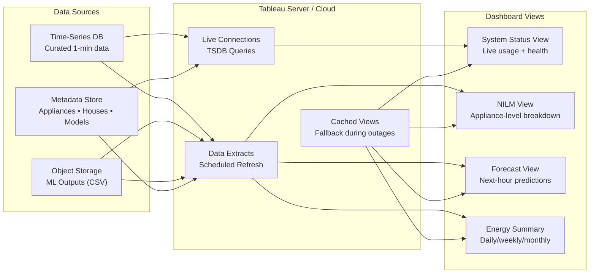

```mermaid
flowchart LR

%% Data Sources
subgraph SOURCES["Data Sources"]
TSDB["Time‑Series DB<br/>Curated 1‑min data"]
OBJ["Object Storage<br/>ML Outputs (CSV)"]
META["Metadata Store<br/>Appliances • Houses • Models"]
end

%% Tableau Server
subgraph TABLEAU["Tableau Server / Cloud"]
EXTRACTS["Data Extracts<br/>Scheduled Refresh"]
LIVE_CONN["Live Connections<br/>TSDB Queries"]
CACHE["Cached Views<br/>Fallback during outages"]
end

%% Dashboard Views
subgraph VIEWS["Dashboard Views"]
STATUS["System Status View<br/>Live usage + health"]
NILM_VIEW["NILM View<br/>Appliance‑level breakdown"]
FORECAST_VIEW["Forecast View<br/>Next‑hour predictions"]
ENERGY_SUM["Energy Summary<br/>Daily/weekly/monthly"]
end

%% Connections
TSDB --> LIVE_CONN --> STATUS
TSDB --> EXTRACTS --> ENERGY_SUM

OBJ --> EXTRACTS --> NILM_VIEW
OBJ --> EXTRACTS --> FORECAST_VIEW

META --> EXTRACTS
META --> LIVE_CONN

TABLEAU --> CACHE
CACHE --> STATUS
CACHE --> NILM_VIEW
CACHE --> FORECAST_VIEW
CACHE --> ENERGY_SUM
```
