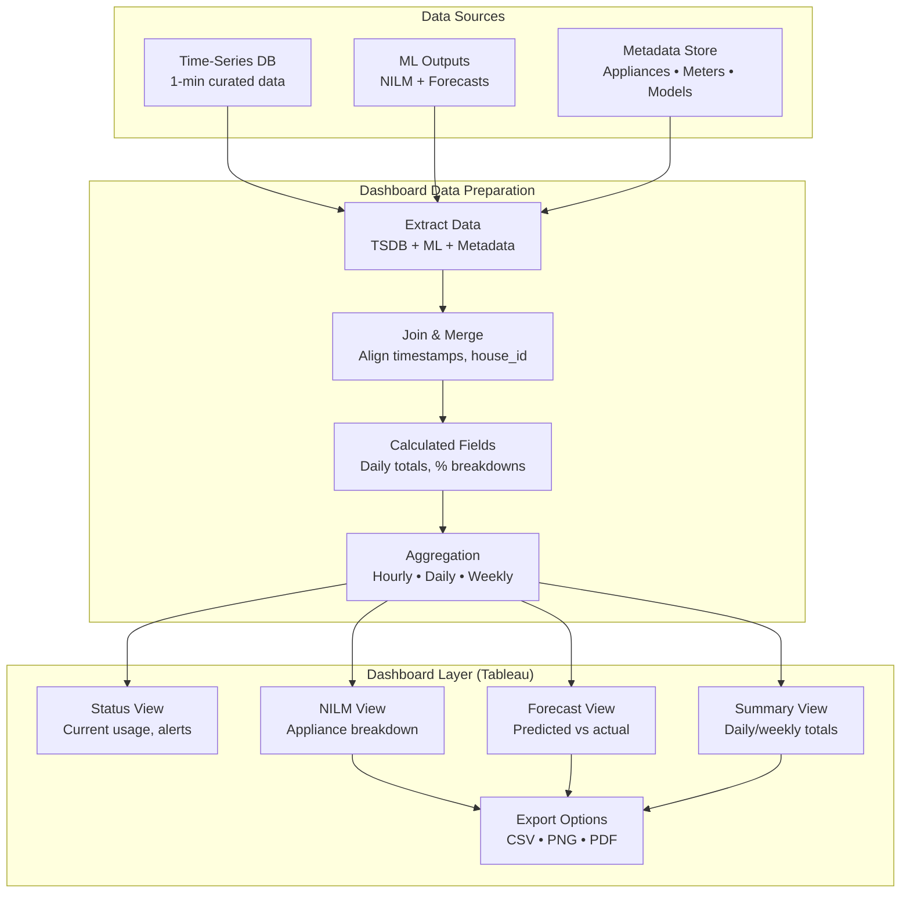

```mermaid
flowchart TB

%% Data Sources
subgraph SOURCES["Data Sources"]
TSDB["Time‑Series DB<br/>1‑min curated data"]
ML_OUT["ML Outputs<br/>NILM + Forecasts"]
META["Metadata Store<br/>Appliances • Meters • Models"]
end

%% Data Prep Layer
subgraph PREP["Dashboard Data Preparation"]
EXTRACT["Extract Data<br/>TSDB + ML + Metadata"]
JOIN["Join & Merge<br/>Align timestamps, house_id"]
CALC["Calculated Fields<br/>Daily totals, % breakdowns"]
AGG["Aggregation<br/>Hourly • Daily • Weekly"]
end

%% Dashboard Layer
subgraph DASH["Dashboard Layer (Tableau)"]
STATUS["Status View<br/>Current usage, alerts"]
SUMMARY["Summary View<br/>Daily/weekly totals"]
NILM_VIEW["NILM View<br/>Appliance breakdown"]
FORECAST_VIEW["Forecast View<br/>Predicted vs actual"]
EXPORT["Export Options<br/>CSV • PNG • PDF"]
end

%% Connections
TSDB --> EXTRACT
ML_OUT --> EXTRACT
META --> EXTRACT

EXTRACT --> JOIN --> CALC --> AGG

AGG --> STATUS
AGG --> SUMMARY
AGG --> NILM_VIEW
AGG --> FORECAST_VIEW

NILM_VIEW --> EXPORT
FORECAST_VIEW --> EXPORT
SUMMARY --> EXPORT
```
