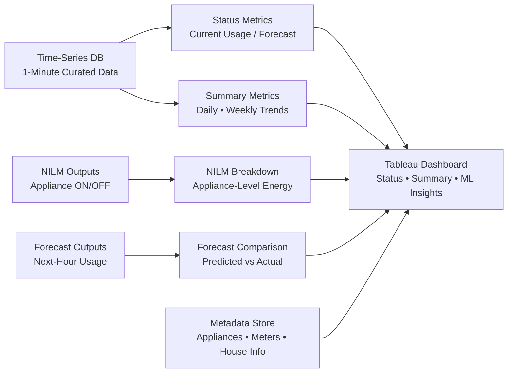

```mermaid
flowchart LR

%% Data Sources
TSDB["Time‑Series DB<br/>1‑Minute Curated Data"]
META["Metadata Store<br/>Appliances • Meters • House Info"]
OUT_CNN["NILM Outputs<br/>Appliance ON/OFF"]
OUT_LSTM["Forecast Outputs<br/>Next‑Hour Usage"]

%% Preprocessing for Dashboard
PREP_STATUS["Status Metrics<br/>Current Usage / Forecast"]
PREP_SUMMARY["Summary Metrics<br/>Daily • Weekly Trends"]
PREP_NILM["NILM Breakdown<br/>Appliance-Level Energy"]
PREP_FORECAST["Forecast Comparison<br/>Predicted vs Actual"]

%% Dashboard
DASH["Tableau Dashboard<br/>Status • Summary • ML Insights"]

%% Connections
TSDB --> PREP_STATUS --> DASH
TSDB --> PREP_SUMMARY --> DASH

OUT_CNN --> PREP_NILM --> DASH
OUT_LSTM --> PREP_FORECAST --> DASH

META --> DASH
```
