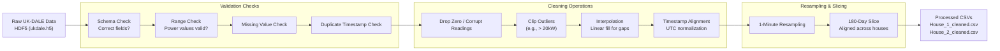

```mermaid
flowchart LR

%% Raw Data
RAW["Raw UK‑DALE Data<br/>HDF5 (ukdale.h5)"]

%% Validation
subgraph VALIDATION["Validation Checks"]
SCHEMA["Schema Check<br/>Correct fields?"]
RANGE["Range Check<br/>Power values valid?"]
MISSING["Missing Value Check"]
DUP["Duplicate Timestamp Check"]
end

%% Cleaning
subgraph CLEANING["Cleaning Operations"]
DROP_ZERO["Drop Zero / Corrupt Readings"]
CLIP["Clip Outliers<br/>(e.g., > 20kW)"]
INTERP["Interpolation<br/>Linear fill for gaps"]
ALIGN["Timestamp Alignment<br/>UTC normalization"]
end

%% Resampling & Slicing
subgraph RESAMPLE["Resampling & Slicing"]
RESAMP["1‑Minute Resampling"]
SLICE["180‑Day Slice<br/>Aligned across houses"]
end

%% Output
PROC["Processed CSVs<br/>House_1_cleaned.csv<br/>House_2_cleaned.csv"]

%% Connections
RAW --> SCHEMA --> RANGE --> MISSING --> DUP --> DROP_ZERO --> CLIP --> INTERP --> ALIGN --> RESAMP --> SLICE --> PROC
```
