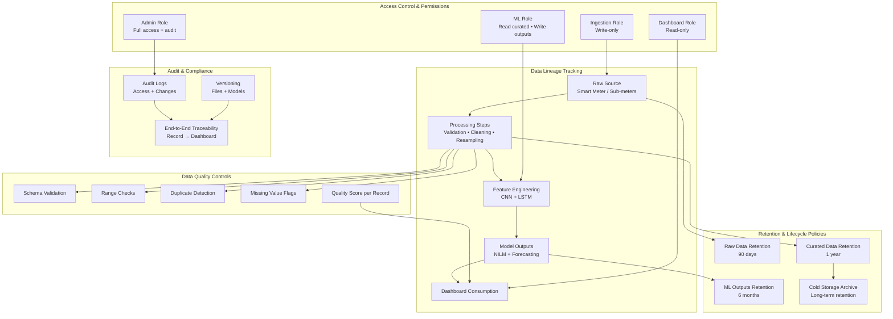

```mermaid
flowchart TB

%% Data Lineage
subgraph LINEAGE["Data Lineage Tracking"]
RAW_SRC["Raw Source<br/>Smart Meter / Sub‑meters"]
PROC_STEP["Processing Steps<br/>Validation • Cleaning • Resampling"]
FEAT_STEP["Feature Engineering<br/>CNN + LSTM"]
MODEL_STEP["Model Outputs<br/>NILM + Forecasting"]
DASH_STEP["Dashboard Consumption"]
end

%% Data Quality
subgraph QUALITY["Data Quality Controls"]
SCHEMA["Schema Validation"]
RANGE["Range Checks"]
DUP["Duplicate Detection"]
MISSING["Missing Value Flags"]
QUALITY_SCORE["Quality Score per Record"]
end

%% Retention & Lifecycle
subgraph RETAIN["Retention & Lifecycle Policies"]
RAW_RET["Raw Data Retention<br/>90 days"]
CURATED_RET["Curated Data Retention<br/>1 year"]
ML_RET["ML Outputs Retention<br/>6 months"]
ARCHIVE["Cold Storage Archive<br/>Long‑term retention"]
end

%% Access Control
subgraph ACCESS["Access Control & Permissions"]
ROLE_INGEST["Ingestion Role<br/>Write‑only"]
ROLE_ML["ML Role<br/>Read curated • Write outputs"]
ROLE_DASH["Dashboard Role<br/>Read‑only"]
ROLE_ADMIN["Admin Role<br/>Full access + audit"]
end

%% Audit & Compliance
subgraph AUDIT["Audit & Compliance"]
AUDIT_LOGS["Audit Logs<br/>Access + Changes"]
VERSIONING["Versioning<br/>Files + Models"]
TRACE["End‑to‑End Traceability<br/>Record → Dashboard"]
end

%% Connections
RAW_SRC --> PROC_STEP --> FEAT_STEP --> MODEL_STEP --> DASH_STEP

PROC_STEP --> SCHEMA
PROC_STEP --> RANGE
PROC_STEP --> DUP
PROC_STEP --> MISSING
QUALITY_SCORE --> DASH_STEP

RAW_SRC --> RAW_RET
PROC_STEP --> CURATED_RET
MODEL_STEP --> ML_RET
CURATED_RET --> ARCHIVE

ROLE_INGEST --> RAW_SRC
ROLE_ML --> FEAT_STEP
ROLE_DASH --> DASH_STEP
ROLE_ADMIN --> AUDIT_LOGS

AUDIT_LOGS --> TRACE
VERSIONING --> TRACE
```
