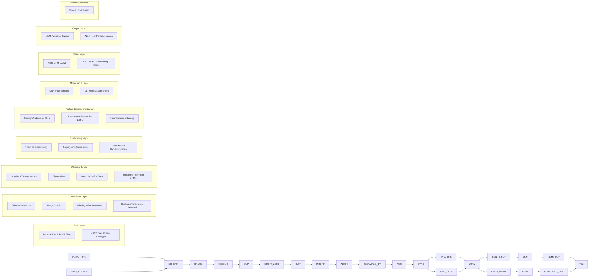

```mermaid

flowchart LR


%% Raw Layer

subgraph RAW\["Raw Layer"]

RAW\_HDF5\["Raw UK‑DALE HDF5 Files"]

RAW\_STREAM\["MQTT Raw Stream Messages"]

end


%% Validation Layer

subgraph VALID\["Validation Layer"]

SCHEMA\["Schema Validation"]

RANGE\["Range Checks"]

MISSING\["Missing Value Detection"]

DUP\["Duplicate Timestamp Removal"]

end


%% Cleaning Layer

subgraph CLEAN\["Cleaning Layer"]

DROP\_ZERO\["Drop Zero/Corrupt Values"]

CLIP\["Clip Outliers"]

INTERP\["Interpolation for Gaps"]

ALIGN\["Timestamp Alignment (UTC)"]

end


%% Resampling Layer

subgraph RESAMP\["Resampling Layer"]

RESAMPLE\_1M\["1‑Minute Resampling"]

AGG\["Aggregation (mean/sum)"]

SYNC\["Cross‑House Synchronization"]

end


%% Feature Layer

subgraph FEAT\["Feature Engineering Layer"]

WIN\_CNN\["Sliding Windows for CNN"]

WIN\_LSTM\["Sequence Windows for LSTM"]

NORM\["Normalization / Scaling"]

end


%% Model Inputs

subgraph MODEL\_IN\["Model Input Layer"]

CNN\_INPUT\["CNN Input Tensors"]

LSTM\_INPUT\["LSTM Input Sequences"]

end


%% Models

subgraph MODELS\["Model Layer"]

CNN\["CNN NILM Model"]

LSTM\["LSTM/GRU Forecasting Model"]

end


%% Outputs

subgraph OUTPUTS\["Output Layer"]

NILM\_OUT\["NILM Appliance Events"]

FORECAST\_OUT\["Next‑Hour Forecast Values"]

end


%% Dashboard

subgraph DASH\["Dashboard Layer"]

TBL\["Tableau Dashboard"]

end


%% Connections

RAW\_HDF5 --> SCHEMA

RAW\_STREAM --> SCHEMA


SCHEMA --> RANGE --> MISSING --> DUP --> DROP\_ZERO --> CLIP --> INTERP --> ALIGN --> RESAMPLE\_1M --> AGG --> SYNC


SYNC --> WIN\_CNN --> NORM --> CNN\_INPUT --> CNN --> NILM\_OUT --> TBL

SYNC --> WIN\_LSTM --> NORM --> LSTM\_INPUT --> LSTM --> FORECAST\_OUT --> TBL

```

