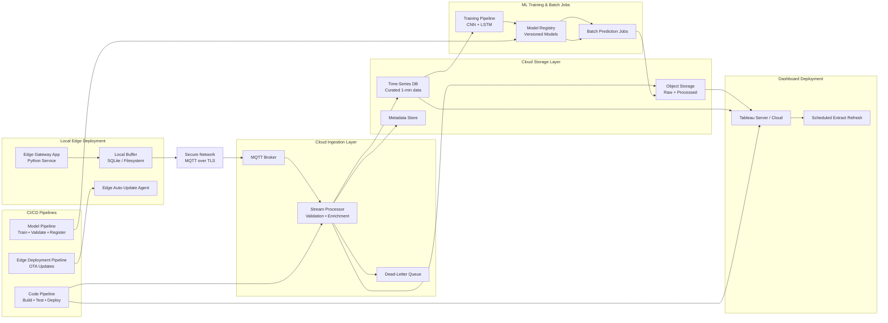

```mermaid
flowchart LR

%% Edge Layer
subgraph EDGE["Local Edge Deployment"]
EDGE_APP["Edge Gateway App<br/>Python Service"]
EDGE_BUF["Local Buffer<br/>SQLite / Filesystem"]
EDGE_UPD["Edge Auto‑Update Agent"]
end

%% Network
NET["Secure Network<br/>MQTT over TLS"]

%% Cloud Ingestion Layer
subgraph INGEST["Cloud Ingestion Layer"]
MQTT_BROKER["MQTT Broker"]
STREAM_PROC["Stream Processor<br/>Validation • Enrichment"]
DLQ["Dead‑Letter Queue"]
end

%% Storage Layer
subgraph STORAGE["Cloud Storage Layer"]
TSDB["Time‑Series DB<br/>Curated 1‑min data"]
OBJ["Object Storage<br/>Raw + Processed"]
META["Metadata Store"]
end

%% ML Layer
subgraph ML["ML Training & Batch Jobs"]
TRAIN_PIPE["Training Pipeline<br/>CNN + LSTM"]
MODEL_REG["Model Registry<br/>Versioned Models"]
BATCH_PRED["Batch Prediction Jobs"]
end

%% Dashboard Layer
subgraph DASH["Dashboard Deployment"]
TABLEAU["Tableau Server / Cloud"]
DASH_UPD["Scheduled Extract Refresh"]
end

%% CI/CD Layer
subgraph CICD["CI/CD Pipelines"]
CODE_PIPE["Code Pipeline<br/>Build • Test • Deploy"]
MODEL_PIPE["Model Pipeline<br/>Train • Validate • Register"]
EDGE_PIPE["Edge Deployment Pipeline<br/>OTA Updates"]
end

%% Connections
EDGE_APP --> EDGE_BUF --> NET --> MQTT_BROKER --> STREAM_PROC --> TSDB
STREAM_PROC --> OBJ
STREAM_PROC --> META
STREAM_PROC --> DLQ

TSDB --> TRAIN_PIPE --> MODEL_REG --> BATCH_PRED --> OBJ
MODEL_REG --> BATCH_PRED

OBJ --> TABLEAU
TSDB --> TABLEAU
TABLEAU --> DASH_UPD

CODE_PIPE --> STREAM_PROC
CODE_PIPE --> TABLEAU
MODEL_PIPE --> MODEL_REG
EDGE_PIPE --> EDGE_UPD
```
