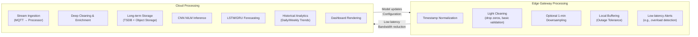

```mermaid
flowchart LR

%% Edge Processing
subgraph EDGE["Edge Gateway Processing"]
EP1["Timestamp Normalization"]
EP2["Light Cleaning<br/>(drop zeros, basic validation)"]
EP3["Optional 1‑min Downsampling"]
EP4["Local Buffering<br/>(Outage Tolerance)"]
EP5["Low‑latency Alerts<br/>(e.g., overload detection)"]
end

%% Cloud Processing
subgraph CLOUD["Cloud Processing"]
CP1["Stream Ingestion<br/>(MQTT → Processor)"]
CP2["Deep Cleaning & Enrichment"]
CP3["Long‑term Storage<br/>(TSDB + Object Storage)"]
CP4["CNN NILM Inference"]
CP5["LSTM/GRU Forecasting"]
CP6["Historical Analytics<br/>(Daily/Weekly Trends)"]
CP7["Dashboard Rendering"]
end

%% Tradeoff Arrows
EDGE -->|Low latency<br/>Bandwidth reduction| CLOUD
CLOUD -->|Model updates<br/>Configuration| EDGE
```
