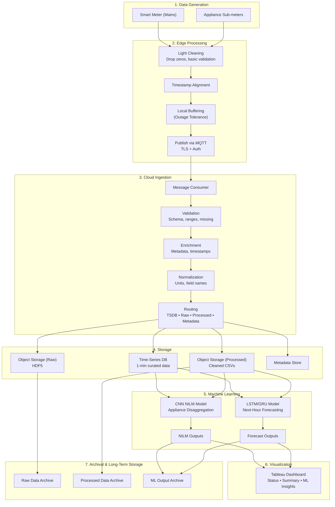

```mermaid
flowchart TB

%% Data Generation
subgraph GEN["1. Data Generation"]
SM["Smart Meter (Mains)"]
AM["Appliance Sub‑meters"]
end

%% Edge Processing
subgraph EDGE["2. Edge Processing"]
CLEAN_EDGE["Light Cleaning<br/>Drop zeros, basic validation"]
ALIGN_EDGE["Timestamp Alignment"]
BUFFER["Local Buffering<br/>(Outage Tolerance)"]
SEND["Publish via MQTT<br/>TLS + Auth"]
end

%% Cloud Ingestion
subgraph INGEST["3. Cloud Ingestion"]
CONSUME["Message Consumer"]
VALIDATE["Validation<br/>Schema, ranges, missing"]
ENRICH["Enrichment<br/>Metadata, timestamps"]
NORMALIZE["Normalization<br/>Units, field names"]
ROUTE["Routing<br/>TSDB • Raw • Processed • Metadata"]
end

%% Storage
subgraph STORAGE["4. Storage"]
TSDB["Time‑Series DB<br/>1‑min curated data"]
RAW["Object Storage (Raw)<br/>HDF5"]
PROC["Object Storage (Processed)<br/>Cleaned CSVs"]
META["Metadata Store"]
end

%% ML Pipelines
subgraph ML["5. Machine Learning"]
CNN["CNN NILM Model<br/>Appliance Disaggregation"]
LSTM["LSTM/GRU Model<br/>Next‑Hour Forecasting"]
OUT_CNN["NILM Outputs"]
OUT_LSTM["Forecast Outputs"]
end

%% Visualization
subgraph DASH["6. Visualization"]
TBL["Tableau Dashboard<br/>Status • Summary • ML Insights"]
end

%% Archival
subgraph ARCHIVE["7. Archival & Long‑Term Storage"]
ARCH_RAW["Raw Data Archive"]
ARCH_PROC["Processed Data Archive"]
ARCH_ML["ML Output Archive"]
end

%% Connections
SM --> CLEAN_EDGE
AM --> CLEAN_EDGE
CLEAN_EDGE --> ALIGN_EDGE --> BUFFER --> SEND

SEND --> CONSUME --> VALIDATE --> ENRICH --> NORMALIZE --> ROUTE

ROUTE --> TSDB
ROUTE --> RAW
ROUTE --> PROC
ROUTE --> META

TSDB --> CNN --> OUT_CNN --> TBL
TSDB --> LSTM --> OUT_LSTM --> TBL

PROC --> CNN
PROC --> LSTM

RAW --> ARCH_RAW
PROC --> ARCH_PROC
OUT_CNN --> ARCH_ML
OUT_LSTM --> ARCH_ML
```
