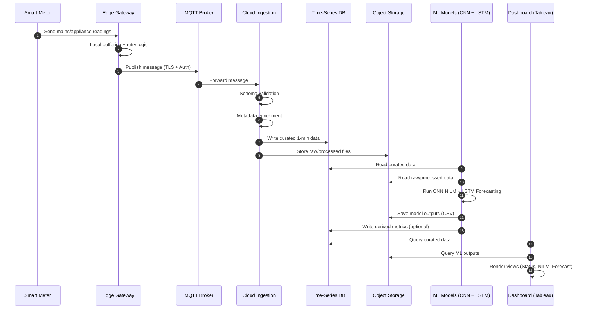

```mermaid

sequenceDiagram

autonumber


participant SM as Smart Meter

participant EDGE as Edge Gateway

participant MQTT as MQTT Broker

participant INGEST as Cloud Ingestion

participant TSDB as Time‑Series DB

participant OBJ as Object Storage

participant ML as ML Models (CNN + LSTM)

participant DASH as Dashboard (Tableau)


SM->>EDGE: Send mains/appliance readings

EDGE->>EDGE: Local buffering + retry logic

EDGE->>MQTT: Publish message (TLS + Auth)


MQTT->>INGEST: Forward message

INGEST->>INGEST: Schema validation

INGEST->>INGEST: Metadata enrichment

INGEST->>TSDB: Write curated 1‑min data

INGEST->>OBJ: Store raw/processed files


ML->>TSDB: Read curated data

ML->>OBJ: Read raw/processed data

ML->>ML: Run CNN NILM + LSTM Forecasting

ML->>OBJ: Save model outputs (CSV)

ML->>TSDB: Write derived metrics (optional)


DASH->>TSDB: Query curated data

DASH->>OBJ: Query ML outputs

DASH->>DASH: Render views (Status, NILM, Forecast)

```

