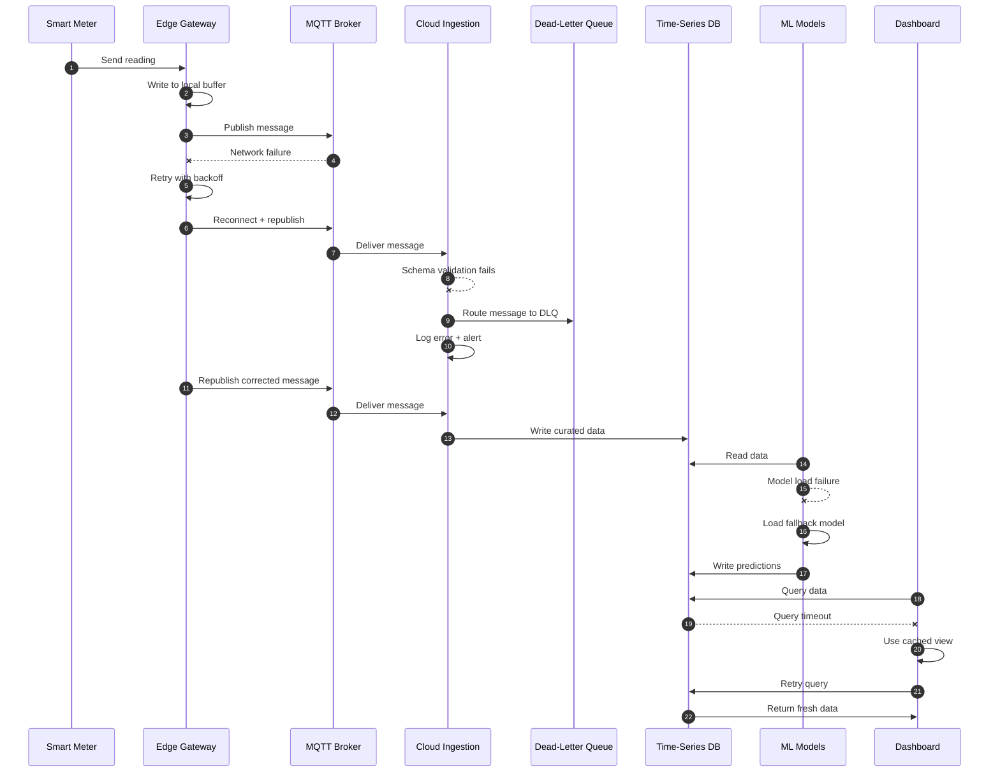

```mermaid

sequenceDiagram

autonumber


participant SM as Smart Meter

participant EDGE as Edge Gateway

participant MQTT as MQTT Broker

participant INGEST as Cloud Ingestion

participant DLQ as Dead‑Letter Queue

participant TSDB as Time‑Series DB

participant ML as ML Models

participant DASH as Dashboard


%% Edge Failure + Recovery

SM->>EDGE: Send reading

EDGE->>EDGE: Write to local buffer

EDGE->>MQTT: Publish message

MQTT--xEDGE: Network failure

EDGE->>EDGE: Retry with backoff

EDGE->>MQTT: Reconnect + republish


%% Ingestion Failure + DLQ

MQTT->>INGEST: Deliver message

INGEST--xINGEST: Schema validation fails

INGEST->>DLQ: Route message to DLQ

INGEST->>INGEST: Log error + alert


%% Successful Ingestion After Recovery

EDGE->>MQTT: Republish corrected message

MQTT->>INGEST: Deliver message

INGEST->>TSDB: Write curated data


%% ML Pipeline Error + Fallback

ML->>TSDB: Read data

ML--xML: Model load failure

ML->>ML: Load fallback model

ML->>TSDB: Write predictions


%% Dashboard Degradation + Recovery

DASH->>TSDB: Query data

TSDB--xDASH: Query timeout

DASH->>DASH: Use cached view

DASH->>TSDB: Retry query

TSDB->>DASH: Return fresh data

```

