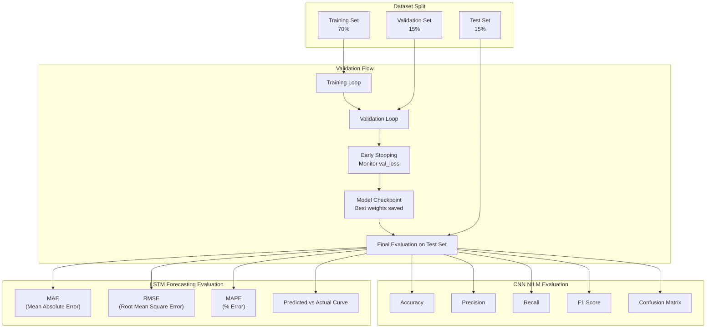

```mermaid
flowchart TB

%% Dataset Split
subgraph SPLIT["Dataset Split"]
TRAIN["Training Set<br/>70%"]
VAL["Validation Set<br/>15%"]
TEST["Test Set<br/>15%"]
end

%% CNN Metrics
subgraph CNN_METRICS["CNN NILM Evaluation"]
ACC["Accuracy"]
PREC["Precision"]
REC["Recall"]
F1["F1 Score"]
CONF["Confusion Matrix"]
end

%% LSTM Metrics
subgraph LSTM_METRICS["LSTM Forecasting Evaluation"]
MAE["MAE<br/>(Mean Absolute Error)"]
RMSE["RMSE<br/>(Root Mean Square Error)"]
MAPE["MAPE<br/>(% Error)"]
CURVE["Predicted vs Actual Curve"]
end

%% Validation Flow
subgraph FLOW["Validation Flow"]
TRAIN_LOOP["Training Loop"]
VAL_LOOP["Validation Loop"]
EARLY_STOP["Early Stopping<br/>Monitor val_loss"]
CHECKPOINT["Model Checkpoint<br/>Best weights saved"]
FINAL_EVAL["Final Evaluation on Test Set"]
end

%% Connections
TRAIN --> TRAIN_LOOP --> VAL_LOOP --> EARLY_STOP --> CHECKPOINT --> FINAL_EVAL
VAL --> VAL_LOOP
TEST --> FINAL_EVAL

FINAL_EVAL --> ACC
FINAL_EVAL --> PREC
FINAL_EVAL --> REC
FINAL_EVAL --> F1
FINAL_EVAL --> CONF

FINAL_EVAL --> MAE
FINAL_EVAL --> RMSE
FINAL_EVAL --> MAPE
FINAL_EVAL --> CURVE
```
