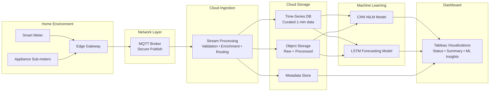

```mermaid
flowchart LR

%% Home Layer
subgraph HOME["Home Environment"]
SM["Smart Meter"]
AM["Appliance Sub‑meters"]
EDGE["Edge Gateway"]
end

%% Network Layer
subgraph NET["Network Layer"]
MQTT["MQTT Broker<br/>Secure Publish"]
end

%% Cloud Ingestion
subgraph INGEST["Cloud Ingestion"]
PROC["Stream Processing<br/>Validation • Enrichment • Routing"]
end

%% Storage Layer
subgraph STORAGE["Cloud Storage"]
TSDB["Time‑Series DB<br/>Curated 1‑min data"]
OBJ["Object Storage<br/>Raw + Processed"]
META["Metadata Store"]
end

%% ML Layer
subgraph ML["Machine Learning"]
CNN["CNN NILM Model"]
LSTM["LSTM Forecasting Model"]
end

%% Dashboard Layer
subgraph DASH["Dashboard"]
TBL["Tableau Visualizations<br/>Status • Summary • ML Insights"]
end

%% Connections
SM --> EDGE
AM --> EDGE
EDGE --> MQTT --> PROC

PROC --> TSDB
PROC --> OBJ
PROC --> META

TSDB --> CNN --> TBL
TSDB --> LSTM --> TBL

OBJ --> CNN
OBJ --> LSTM

META --> TBL
```
