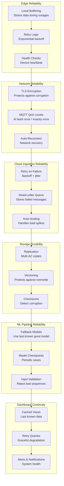

```mermaid
flowchart TB

%% Edge Reliability
subgraph EDGE["Edge Reliability"]
BUF["Local Buffering<br/>Stores data during outages"]
RETRY_EDGE["Retry Logic<br/>Exponential backoff"]
HEALTH_EDGE["Health Checks<br/>Device heartbeat"]
end

%% Network Reliability
subgraph NET["Network Reliability"]
TLS["TLS Encryption<br/>Protects against corruption"]
QOS["MQTT QoS Levels<br/>At least once / exactly once"]
RECONNECT["Auto‑Reconnect<br/>Network recovery"]
end

%% Cloud Ingestion Reliability
subgraph INGEST["Cloud Ingestion Reliability"]
RETRY_INGEST["Retry on Failure<br/>Backoff + jitter"]
DLQ["Dead‑Letter Queue<br/>Stores failed messages"]
SCALE["Auto‑Scaling<br/>Handles load spikes"]
end

%% Storage Durability
subgraph STORAGE["Storage Durability"]
REPL["Replication<br/>Multi‑AZ copies"]
VERSION["Versioning<br/>Protects against overwrite"]
CHECKSUM["Checksums<br/>Detect corruption"]
end

%% ML Pipeline Reliability
subgraph ML["ML Pipeline Reliability"]
FALLBACK["Fallback Models<br/>Use last known good model"]
CHECKPOINT["Model Checkpoints<br/>Periodic saves"]
VALIDATE_ML["Input Validation<br/>Reject bad sequences"]
end

%% Dashboard Continuity
subgraph DASH["Dashboard Continuity"]
CACHE["Cached Views<br/>Last known data"]
RETRY_DASH["Retry Queries<br/>Graceful degradation"]
ALERTS["Alerts & Notifications<br/>System health"]
end

%% Connections
BUF --> RETRY_EDGE --> HEALTH_EDGE --> TLS --> QOS --> RECONNECT --> RETRY_INGEST --> DLQ --> SCALE --> REPL --> VERSION --> CHECKSUM --> FALLBACK --> CHECKPOINT --> VALIDATE_ML --> CACHE --> RETRY_DASH --> ALERTS
```
