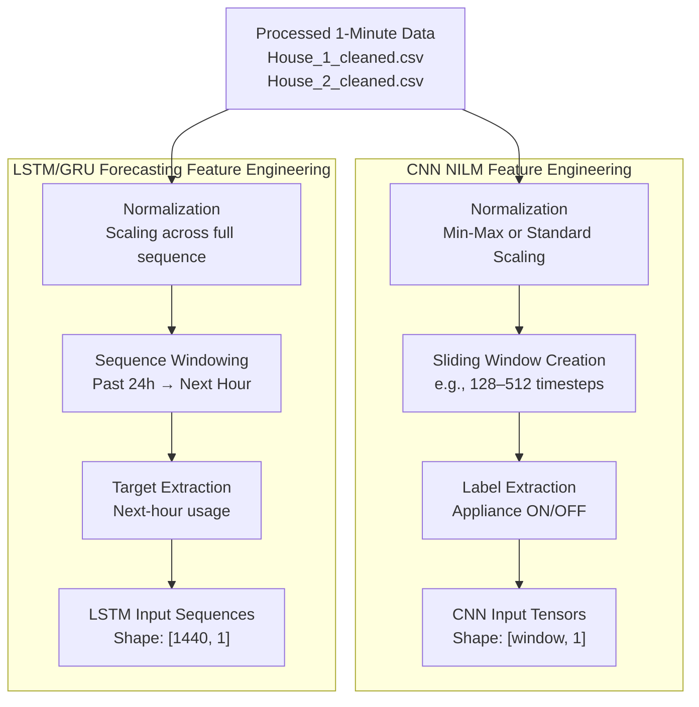

```mermaid
flowchart TB

%% Input
PROC["Processed 1‑Minute Data<br/>House_1_cleaned.csv<br/>House_2_cleaned.csv"]

%% CNN Branch
subgraph CNN_FE["CNN NILM Feature Engineering"]
NORM_CNN["Normalization<br/>Min‑Max or Standard Scaling"]
WIN_CNN["Sliding Window Creation<br/>e.g., 128–512 timesteps"]
LABEL_CNN["Label Extraction<br/>Appliance ON/OFF"]
CNN_INPUT["CNN Input Tensors<br/>Shape: [window, 1]"]
end

%% LSTM Branch
subgraph LSTM_FE["LSTM/GRU Forecasting Feature Engineering"]
NORM_LSTM["Normalization<br/>Scaling across full sequence"]
WIN_LSTM["Sequence Windowing<br/>Past 24h → Next Hour"]
TARGET_LSTM["Target Extraction<br/>Next‑hour usage"]
LSTM_INPUT["LSTM Input Sequences<br/>Shape: [1440, 1]"]
end

%% Connections
PROC --> NORM_CNN --> WIN_CNN --> LABEL_CNN --> CNN_INPUT
PROC --> NORM_LSTM --> WIN_LSTM --> TARGET_LSTM --> LSTM_INPUT
```
