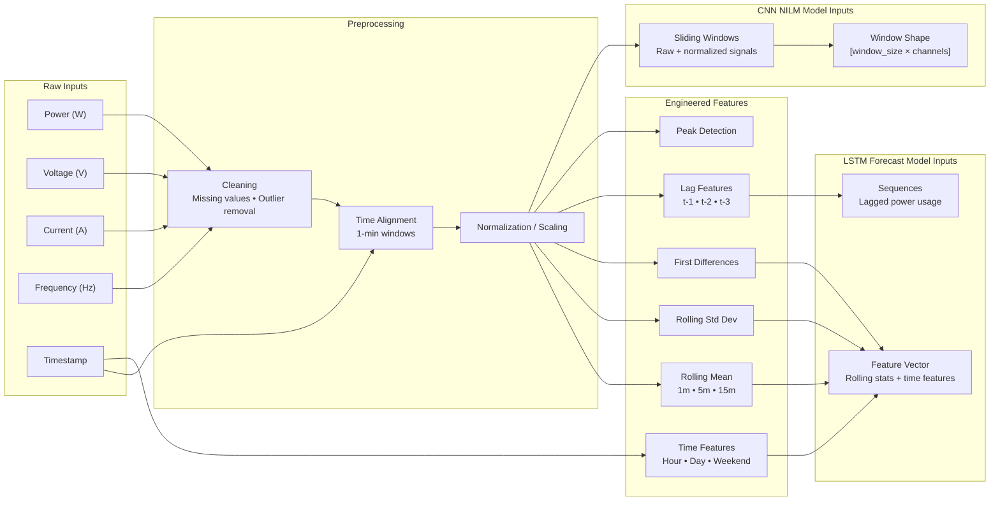

```mermaid
flowchart LR

%% Raw Inputs
subgraph RAW["Raw Inputs"]
POWER["Power (W)"]
VOLT["Voltage (V)"]
CURR["Current (A)"]
FREQ["Frequency (Hz)"]
TIME["Timestamp"]
end

%% Preprocessing
subgraph PREP["Preprocessing"]
CLEAN["Cleaning<br/>Missing values • Outlier removal"]
ALIGN["Time Alignment<br/>1‑min windows"]
NORM["Normalization / Scaling"]
end

%% Feature Engineering
subgraph FEAT["Engineered Features"]
ROLL_MEAN["Rolling Mean<br/>1m • 5m • 15m"]
ROLL_STD["Rolling Std Dev"]
DIFF["First Differences"]
LAGS["Lag Features<br/>t‑1 • t‑2 • t‑3"]
PEAKS["Peak Detection"]
TIME_FEATS["Time Features<br/>Hour • Day • Weekend"]
end

%% Model Inputs — CNN
subgraph CNN["CNN NILM Model Inputs"]
CNN_WIN["Sliding Windows<br/>Raw + normalized signals"]
CNN_SHAPE["Window Shape<br/>[window_size × channels]"]
end

%% Model Inputs — LSTM
subgraph LSTM["LSTM Forecast Model Inputs"]
LSTM_SEQ["Sequences<br/>Lagged power usage"]
LSTM_FEATS["Feature Vector<br/>Rolling stats + time features"]
end

%% Connections
POWER --> CLEAN
VOLT --> CLEAN
CURR --> CLEAN
FREQ --> CLEAN
TIME --> ALIGN

CLEAN --> ALIGN --> NORM

NORM --> ROLL_MEAN
NORM --> ROLL_STD
NORM --> DIFF
NORM --> LAGS
NORM --> PEAKS
TIME --> TIME_FEATS

%% CNN Inputs
NORM --> CNN_WIN --> CNN_SHAPE

%% LSTM Inputs
ROLL_MEAN --> LSTM_FEATS
ROLL_STD --> LSTM_FEATS
DIFF --> LSTM_FEATS
LAGS --> LSTM_SEQ
TIME_FEATS --> LSTM_FEATS
```
