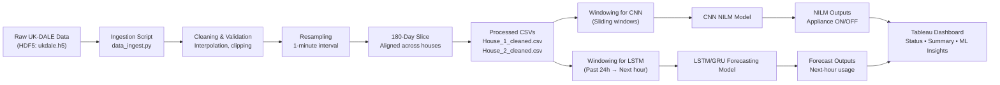

```mermaid
flowchart LR

%% Raw Data
RAW["Raw UK‑DALE Data<br/>(HDF5: ukdale.h5)"]

%% Ingestion
INGEST["Ingestion Script<br/>data_ingest.py"]
CLEAN["Cleaning & Validation<br/>Interpolation, clipping"]
RESAMPLE["Resampling<br/>1‑minute interval"]
SLICE["180‑Day Slice<br/>Aligned across houses"]

%% Processed Data
PROC["Processed CSVs<br/>House_1_cleaned.csv<br/>House_2_cleaned.csv"]

%% Modeling
WIN_CNN["Windowing for CNN<br/>(Sliding windows)"]
WIN_LSTM["Windowing for LSTM<br/>(Past 24h → Next hour)"]

CNN["CNN NILM Model"]
LSTM["LSTM/GRU Forecasting Model"]

%% Outputs
OUT_CNN["NILM Outputs<br/>Appliance ON/OFF"]
OUT_LSTM["Forecast Outputs<br/>Next‑hour usage"]

%% Dashboard
DASH["Tableau Dashboard<br/>Status • Summary • ML Insights"]

%% Connections
RAW --> INGEST --> CLEAN --> RESAMPLE --> SLICE --> PROC

PROC --> WIN_CNN --> CNN --> OUT_CNN --> DASH
PROC --> WIN_LSTM --> LSTM --> OUT_LSTM --> DASH
```
