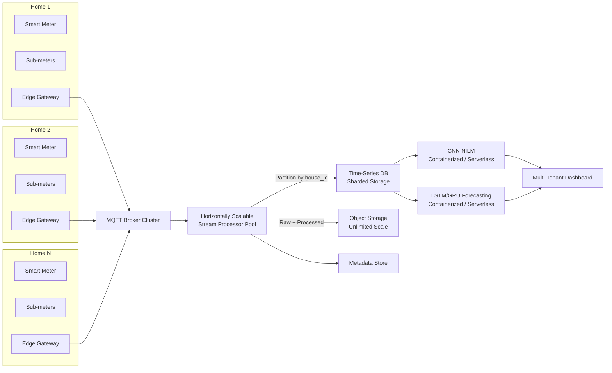

```mermaid
flowchart LR

%% Multiple Homes
subgraph H1["Home 1"]
SM1["Smart Meter"]
AM1["Sub‑meters"]
EDGE1["Edge Gateway"]
end

subgraph H2["Home 2"]
SM2["Smart Meter"]
AM2["Sub‑meters"]
EDGE2["Edge Gateway"]
end

subgraph H3["Home N"]
SM3["Smart Meter"]
AM3["Sub‑meters"]
EDGE3["Edge Gateway"]
end

%% Network
EDGE1 --> MQTT["MQTT Broker Cluster"]
EDGE2 --> MQTT
EDGE3 --> MQTT

%% Cloud Ingestion
MQTT --> INGEST["Horizontally Scalable<br/>Stream Processor Pool"]

%% Partitioning
INGEST -->|Partition by house_id| TSDB["Time‑Series DB<br/>Sharded Storage"]
INGEST -->|Raw + Processed| DL["Object Storage<br/>Unlimited Scale"]
INGEST --> META["Metadata Store"]

%% ML Pipelines
TSDB --> ML_CNN["CNN NILM<br/>Containerized / Serverless"]
TSDB --> ML_LSTM["LSTM/GRU Forecasting<br/>Containerized / Serverless"]

%% Outputs
ML_CNN --> DASH["Multi‑Tenant Dashboard"]
ML_LSTM --> DASH
```
