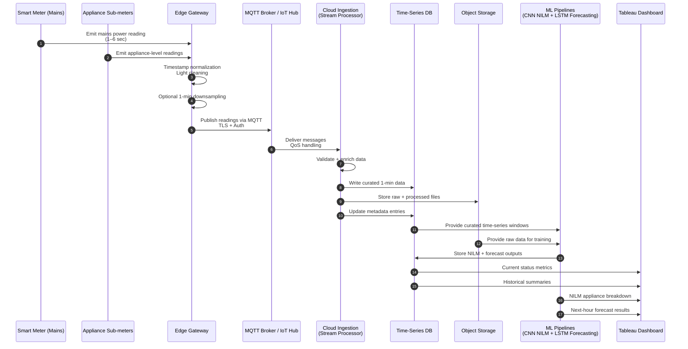

```mermaid
sequenceDiagram
autonumber

participant SM as Smart Meter (Mains)
participant AM as Appliance Sub‑meters
participant EDGE as Edge Gateway
participant MQTT as MQTT Broker / IoT Hub
participant INGEST as Cloud Ingestion<br/>(Stream Processor)
participant TSDB as Time‑Series DB
participant DL as Object Storage
participant ML as ML Pipelines<br/>(CNN NILM + LSTM Forecasting)
participant DASH as Tableau Dashboard

%% Sensor Emission
SM->>EDGE: Emit mains power reading<br/>(1–6 sec)
AM->>EDGE: Emit appliance-level readings

%% Edge Processing
EDGE->>EDGE: Timestamp normalization<br/>Light cleaning
EDGE->>EDGE: Optional 1‑min downsampling
EDGE->>MQTT: Publish readings via MQTT<br/>TLS + Auth

%% Cloud Ingestion
MQTT->>INGEST: Deliver messages<br/>QoS handling
INGEST->>INGEST: Validate + enrich data
INGEST->>TSDB: Write curated 1‑min data
INGEST->>DL: Store raw + processed files
INGEST->>TSDB: Update metadata entries

%% ML Pipelines
TSDB->>ML: Provide curated time‑series windows
DL->>ML: Provide raw data for training
ML->>TSDB: Store NILM + forecast outputs

%% Dashboard
TSDB->>DASH: Current status metrics
TSDB->>DASH: Historical summaries
ML->>DASH: NILM appliance breakdown
ML->>DASH: Next‑hour forecast results
```
