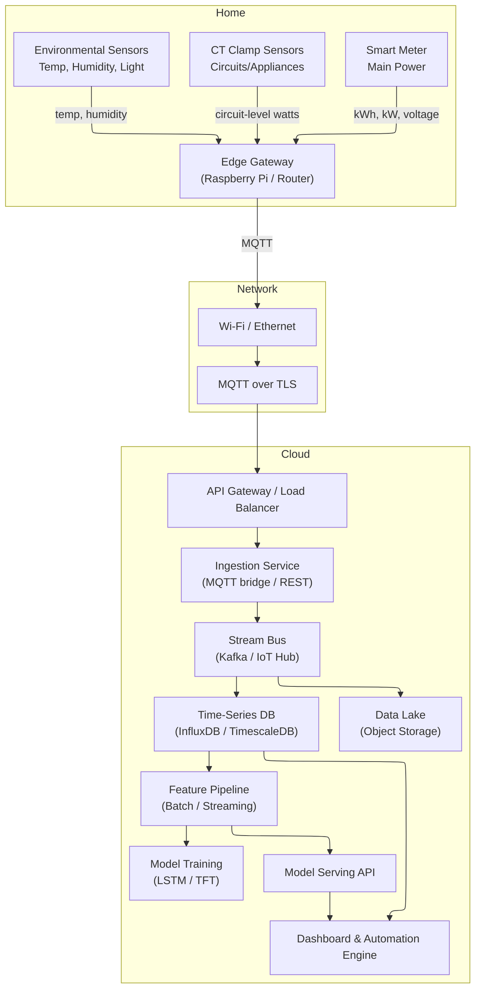

```mermaid
---
config:
  layout: elk
---
flowchart TB

subgraph Home["Home"]
SM["Smart Meter<br/>Main Power"]
CT1["CT Clamp Sensors<br/>Circuits/Appliances"]
ENV["Environmental Sensors<br/>Temp, Humidity, Light"]
GW["Edge Gateway<br/>(Raspberry Pi / Router)"]
end

subgraph Network["Network"]
WIFI["Wi‑Fi / Ethernet"]
MQTT["MQTT over TLS"]
end

subgraph Cloud["Cloud"]
LB["API Gateway / Load Balancer"]
ING["Ingestion Service<br/>(MQTT bridge / REST)"]
KAFKA["Stream Bus<br/>(Kafka / IoT Hub)"]
TSDB["Time‑Series DB<br/>(InfluxDB / TimescaleDB)"]
DATALAKE["Data Lake<br/>(Object Storage)"]
FEAT["Feature Pipeline<br/>(Batch / Streaming)"]
MLTRAIN["Model Training<br/>(LSTM / TFT)"]
MLSERVE["Model Serving API"]
DASH["Dashboard & Automation Engine"]
end

SM -- "kWh, kW, voltage" --> GW
CT1 -- "circuit-level watts" --> GW
ENV -- "temp, humidity" --> GW

GW -- MQTT --> WIFI
WIFI --> MQTT

MQTT --> LB
LB --> ING
ING --> KAFKA

KAFKA --> TSDB
KAFKA --> DATALAKE

TSDB --> FEAT
TSDB --> DASH

FEAT --> MLTRAIN
FEAT --> MLSERVE

MLSERVE --> DASH
```
