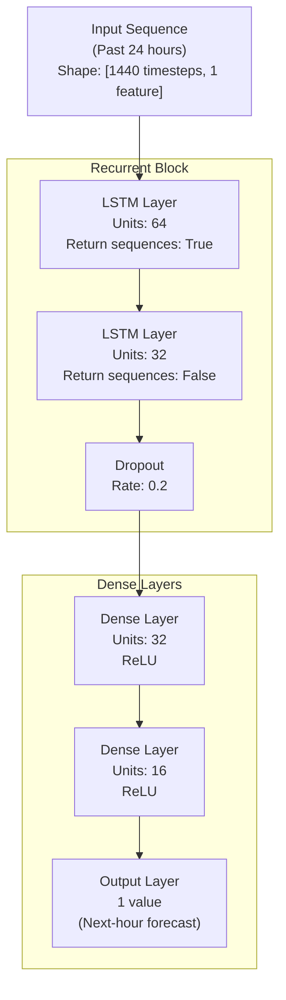

```mermaid
flowchart TB

%% Input
INPUT["Input Sequence<br/>(Past 24 hours)<br/>Shape: [1440 timesteps, 1 feature]"]

%% LSTM/GRU Block
subgraph RNN_BLOCK["Recurrent Block"]
LSTM1["LSTM Layer<br/>Units: 64<br/>Return sequences: True"]
LSTM2["LSTM Layer<br/>Units: 32<br/>Return sequences: False"]
DROPOUT["Dropout<br/>Rate: 0.2"]
end

%% Dense Layers
subgraph DENSE["Dense Layers"]
D1["Dense Layer<br/>Units: 32<br/>ReLU"]
D2["Dense Layer<br/>Units: 16<br/>ReLU"]
OUT["Output Layer<br/>1 value<br/>(Next‑hour forecast)"]
end

%% Connections
INPUT --> LSTM1 --> LSTM2 --> DROPOUT --> D1 --> D2 --> OUT
```
