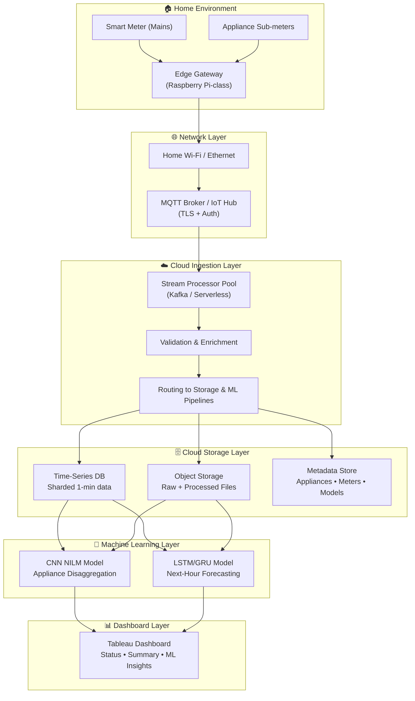

```mermaid
flowchart TB

%% Home Layer
subgraph HOME["🏠 Home Environment"]
SM["Smart Meter (Mains)"]
AM["Appliance Sub‑meters"]
EDGE["Edge Gateway<br/>(Raspberry Pi‑class)"]
end

%% Network Layer
subgraph NET["🌐 Network Layer"]
WIFI["Home Wi‑Fi / Ethernet"]
MQTT["MQTT Broker / IoT Hub<br/>(TLS + Auth)"]
end

%% Cloud Ingestion
subgraph INGEST["☁️ Cloud Ingestion Layer"]
SP["Stream Processor Pool<br/>(Kafka / Serverless)"]
VAL["Validation & Enrichment"]
ROUTE["Routing to Storage & ML Pipelines"]
end

%% Storage Layer
subgraph STORAGE["🗄️ Cloud Storage Layer"]
TSDB["Time‑Series DB<br/>Sharded 1‑min data"]
OBJ["Object Storage<br/>Raw + Processed Files"]
META["Metadata Store<br/>Appliances • Meters • Models"]
end

%% ML Layer
subgraph ML["🤖 Machine Learning Layer"]
CNN["CNN NILM Model<br/>Appliance Disaggregation"]
LSTM["LSTM/GRU Model<br/>Next‑Hour Forecasting"]
end

%% Dashboard Layer
subgraph DASH["📊 Dashboard Layer"]
TBL["Tableau Dashboard<br/>Status • Summary • ML Insights"]
end

%% Connections
SM --> EDGE
AM --> EDGE
EDGE --> WIFI --> MQTT

MQTT --> SP --> VAL --> ROUTE

ROUTE --> TSDB
ROUTE --> OBJ
ROUTE --> META

TSDB --> CNN
TSDB --> LSTM
OBJ --> CNN
OBJ --> LSTM

CNN --> TBL
LSTM --> TBL
```
