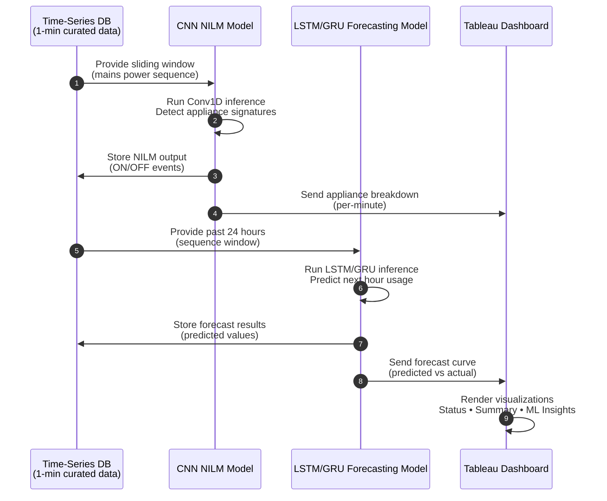

```mermaid
sequenceDiagram
autonumber

participant TSDB as Time‑Series DB<br/>(1‑min curated data)
participant CNN as CNN NILM Model
participant LSTM as LSTM/GRU Forecasting Model
participant DASH as Tableau Dashboard

%% CNN NILM Inference
TSDB->>CNN: Provide sliding window<br/>(mains power sequence)
CNN->>CNN: Run Conv1D inference<br/>Detect appliance signatures
CNN->>TSDB: Store NILM output<br/>(ON/OFF events)
CNN->>DASH: Send appliance breakdown<br/>(per‑minute)

%% LSTM Forecasting Inference
TSDB->>LSTM: Provide past 24 hours<br/>(sequence window)
LSTM->>LSTM: Run LSTM/GRU inference<br/>Predict next hour usage
LSTM->>TSDB: Store forecast results<br/>(predicted values)
LSTM->>DASH: Send forecast curve<br/>(predicted vs actual)

%% Dashboard Rendering
DASH->>DASH: Render visualizations<br/>Status • Summary • ML Insights
```
