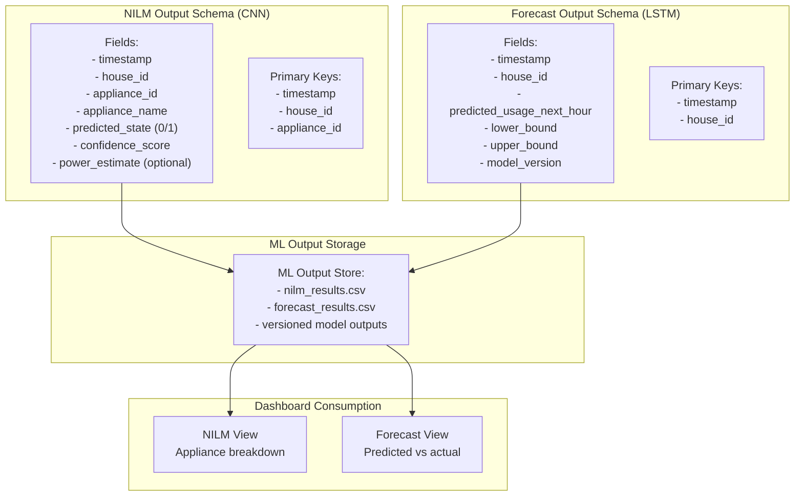

```mermaid
flowchart TB

%% NILM Output Schema
subgraph NILM["NILM Output Schema (CNN)"]
NILM_FIELDS["Fields:<br/>- timestamp<br/>- house_id<br/>- appliance_id<br/>- appliance_name<br/>- predicted_state (0/1)<br/>- confidence_score<br/>- power_estimate (optional)"]
NILM_KEYS["Primary Keys:<br/>- timestamp<br/>- house_id<br/>- appliance_id"]
end

%% Forecast Output Schema
subgraph FORECAST["Forecast Output Schema (LSTM)"]
FORECAST_FIELDS["Fields:<br/>- timestamp<br/>- house_id<br/>- predicted_usage_next_hour<br/>- lower_bound<br/>- upper_bound<br/>- model_version"]
FORECAST_KEYS["Primary Keys:<br/>- timestamp<br/>- house_id"]
end

%% Storage
subgraph STORAGE["ML Output Storage"]
ML_OUT["ML Output Store:<br/>- nilm_results.csv<br/>- forecast_results.csv<br/>- versioned model outputs"]
end

%% Dashboard
subgraph DASH["Dashboard Consumption"]
NILM_VIEW["NILM View<br/>Appliance breakdown"]
FORECAST_VIEW["Forecast View<br/>Predicted vs actual"]
end

%% Connections
NILM_FIELDS --> ML_OUT
FORECAST_FIELDS --> ML_OUT

ML_OUT --> NILM_VIEW
ML_OUT --> FORECAST_VIEW
```
