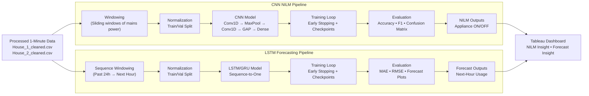

```mermaid
flowchart LR

%% Processed Data
PROC["Processed 1‑Minute Data<br/>House_1_cleaned.csv<br/>House_2_cleaned.csv"]

%% CNN Branch
subgraph CNN_Pipeline["CNN NILM Pipeline"]
direction LR
WIN_CNN["Windowing<br/>(Sliding windows of mains power)"]
PREP_CNN["Normalization<br/>Train/Val Split"]
MODEL_CNN["CNN Model<br/>Conv1D → MaxPool → Conv1D → GAP → Dense"]
TRAIN_CNN["Training Loop<br/>Early Stopping + Checkpoints"]
EVAL_CNN["Evaluation<br/>Accuracy • F1 • Confusion Matrix"]
OUT_CNN["NILM Outputs<br/>Appliance ON/OFF"]
end

%% LSTM Branch
subgraph LSTM_Pipeline["LSTM Forecasting Pipeline"]
direction LR
WIN_LSTM["Sequence Windowing<br/>(Past 24h → Next Hour)"]
PREP_LSTM["Normalization<br/>Train/Val Split"]
MODEL_LSTM["LSTM/GRU Model<br/>Sequence-to-One"]
TRAIN_LSTM["Training Loop<br/>Early Stopping + Checkpoints"]
EVAL_LSTM["Evaluation<br/>MAE • RMSE • Forecast Plots"]
OUT_LSTM["Forecast Outputs<br/>Next‑Hour Usage"]
end

%% Dashboard
DASH["Tableau Dashboard<br/>NILM Insight • Forecast Insight"]

%% Connections
PROC --> WIN_CNN --> PREP_CNN --> MODEL_CNN --> TRAIN_CNN --> EVAL_CNN --> OUT_CNN --> DASH
PROC --> WIN_LSTM --> PREP_LSTM --> MODEL_LSTM --> TRAIN_LSTM --> EVAL_LSTM --> OUT_LSTM --> DASH
```
