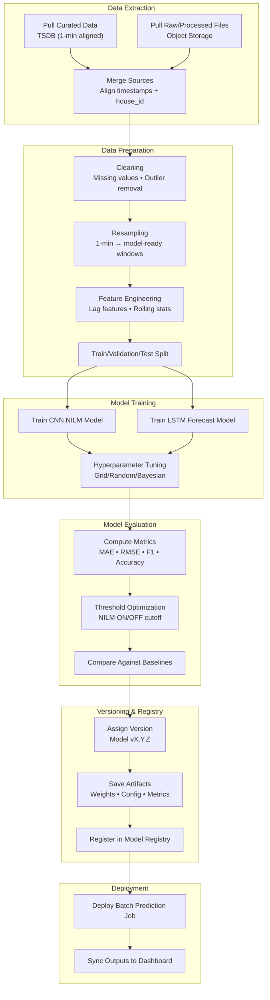

```mermaid
flowchart TB

%% Data Extraction
subgraph EXTRACT["Data Extraction"]
PULL_TSDB["Pull Curated Data<br/>TSDB (1‑min aligned)"]
PULL_OBJ["Pull Raw/Processed Files<br/>Object Storage"]
MERGE["Merge Sources<br/>Align timestamps + house_id"]
end

%% Data Preparation
subgraph PREP["Data Preparation"]
CLEAN["Cleaning<br/>Missing values • Outlier removal"]
RESAMPLE["Resampling<br/>1‑min → model‑ready windows"]
FEAT_ENG["Feature Engineering<br/>Lag features • Rolling stats"]
SPLIT["Train/Validation/Test Split"]
end

%% Training
subgraph TRAIN["Model Training"]
CNN_TRAIN["Train CNN NILM Model"]
LSTM_TRAIN["Train LSTM Forecast Model"]
HP_TUNE["Hyperparameter Tuning<br/>Grid/Random/Bayesian"]
end

%% Evaluation
subgraph EVAL["Model Evaluation"]
METRICS["Compute Metrics<br/>MAE • RMSE • F1 • Accuracy"]
THRESH["Threshold Optimization<br/>NILM ON/OFF cutoff"]
COMPARE["Compare Against Baselines"]
end

%% Versioning & Registry
subgraph REG["Versioning & Registry"]
VERSION["Assign Version<br/>Model vX.Y.Z"]
SAVE_ARTIFACTS["Save Artifacts<br/>Weights • Config • Metrics"]
REGISTER["Register in Model Registry"]
end

%% Deployment
subgraph DEPLOY["Deployment"]
BATCH_JOB["Deploy Batch Prediction Job"]
DASH_SYNC["Sync Outputs to Dashboard"]
end

%% Connections
PULL_TSDB --> MERGE
PULL_OBJ --> MERGE
MERGE --> CLEAN --> RESAMPLE --> FEAT_ENG --> SPLIT

SPLIT --> CNN_TRAIN
SPLIT --> LSTM_TRAIN

CNN_TRAIN --> HP_TUNE
LSTM_TRAIN --> HP_TUNE

HP_TUNE --> METRICS --> THRESH --> COMPARE

COMPARE --> VERSION --> SAVE_ARTIFACTS --> REGISTER

REGISTER --> BATCH_JOB --> DASH_SYNC
```
