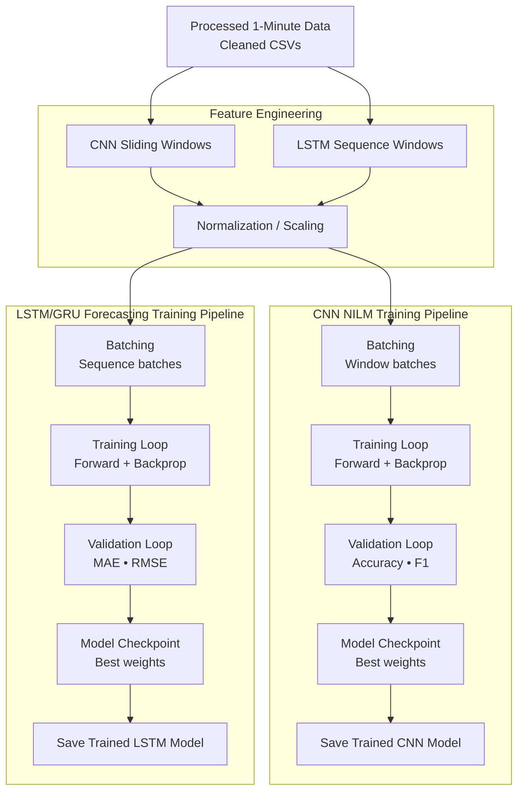

```mermaid
flowchart TB

%% Input Data
PROC["Processed 1‑Minute Data<br/>Cleaned CSVs"]

%% Feature Engineering
subgraph FEAT["Feature Engineering"]
WIN_CNN["CNN Sliding Windows"]
WIN_LSTM["LSTM Sequence Windows"]
NORM["Normalization / Scaling"]
end

%% CNN Training Pipeline
subgraph CNN_PIPE["CNN NILM Training Pipeline"]
BATCH_CNN["Batching<br/>Window batches"]
TRAIN_CNN["Training Loop<br/>Forward + Backprop"]
VAL_CNN["Validation Loop<br/>Accuracy • F1"]
CHECK_CNN["Model Checkpoint<br/>Best weights"]
SAVE_CNN["Save Trained CNN Model"]
end

%% LSTM Training Pipeline
subgraph LSTM_PIPE["LSTM/GRU Forecasting Training Pipeline"]
BATCH_LSTM["Batching<br/>Sequence batches"]
TRAIN_LSTM["Training Loop<br/>Forward + Backprop"]
VAL_LSTM["Validation Loop<br/>MAE • RMSE"]
CHECK_LSTM["Model Checkpoint<br/>Best weights"]
SAVE_LSTM["Save Trained LSTM Model"]
end

%% Connections
PROC --> WIN_CNN --> NORM --> BATCH_CNN --> TRAIN_CNN --> VAL_CNN --> CHECK_CNN --> SAVE_CNN
PROC --> WIN_LSTM --> NORM --> BATCH_LSTM --> TRAIN_LSTM --> VAL_LSTM --> CHECK_LSTM --> SAVE_LSTM
```
