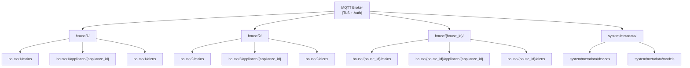

```mermaid
flowchart TD

ROOT["MQTT Broker<br/>(TLS + Auth)"]

%% House-level root
ROOT --> H1["house/1/"]
ROOT --> H2["house/2/"]
ROOT --> HN["house/{house_id}/"]

%% Mains topics
H1 --> H1_MAINS["house/1/mains"]
H2 --> H2_MAINS["house/2/mains"]
HN --> HN_MAINS["house/{house_id}/mains"]

%% Appliance topics
H1 --> H1_APP["house/1/appliance/{appliance_id}"]
H2 --> H2_APP["house/2/appliance/{appliance_id}"]
HN --> HN_APP["house/{house_id}/appliance/{appliance_id}"]

%% Alerts
H1 --> H1_ALERT["house/1/alerts"]
H2 --> H2_ALERT["house/2/alerts"]
HN --> HN_ALERT["house/{house_id}/alerts"]

%% Metadata
ROOT --> META["system/metadata/"]
META --> DEVICES["system/metadata/devices"]
META --> MODELS["system/metadata/models"]
```
