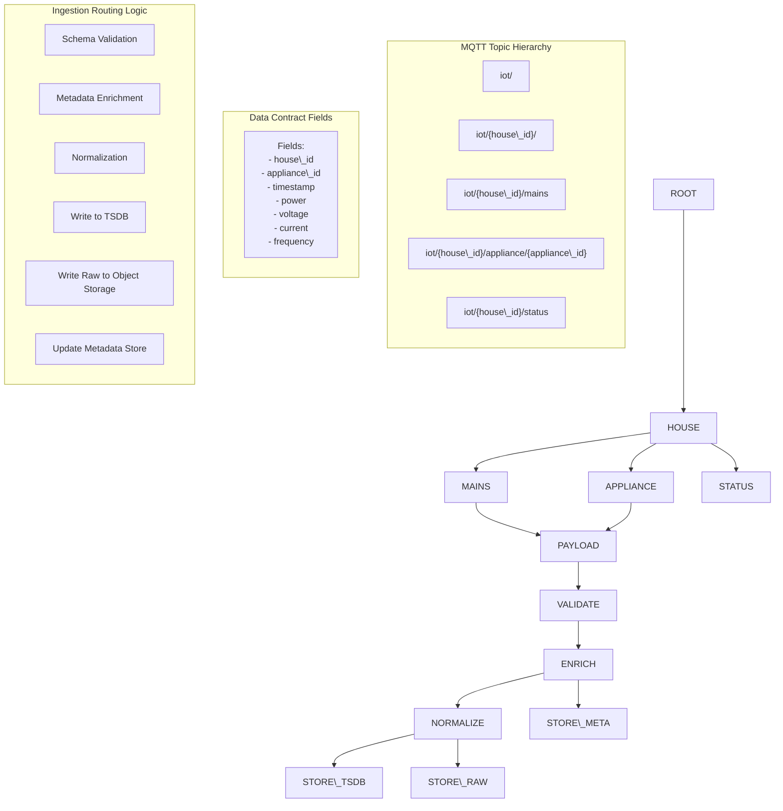

```mermaid

flowchart TB


%% Topic Hierarchy

subgraph TOPICS\["MQTT Topic Hierarchy"]

ROOT\["iot/"]

HOUSE\["iot/{house\_id}/"]

MAINS\["iot/{house\_id}/mains"]

APPLIANCE\["iot/{house\_id}/appliance/{appliance\_id}"]

STATUS\["iot/{house\_id}/status"]

end


%% Data Contract (Field List)

subgraph CONTRACT\["Data Contract Fields"]

PAYLOAD\["Fields:<br/>- house\_id<br/>- appliance\_id<br/>- timestamp<br/>- power<br/>- voltage<br/>- current<br/>- frequency"]

end


%% Ingestion Routing

subgraph ROUTE\["Ingestion Routing Logic"]

VALIDATE\["Schema Validation"]

ENRICH\["Metadata Enrichment"]

NORMALIZE\["Normalization"]

STORE\_TSDB\["Write to TSDB"]

STORE\_RAW\["Write Raw to Object Storage"]

STORE\_META\["Update Metadata Store"]

end


%% Connections

ROOT --> HOUSE --> MAINS --> PAYLOAD

HOUSE --> APPLIANCE --> PAYLOAD

HOUSE --> STATUS


PAYLOAD --> VALIDATE --> ENRICH --> NORMALIZE

NORMALIZE --> STORE\_TSDB

NORMALIZE --> STORE\_RAW

ENRICH --> STORE\_META

```

